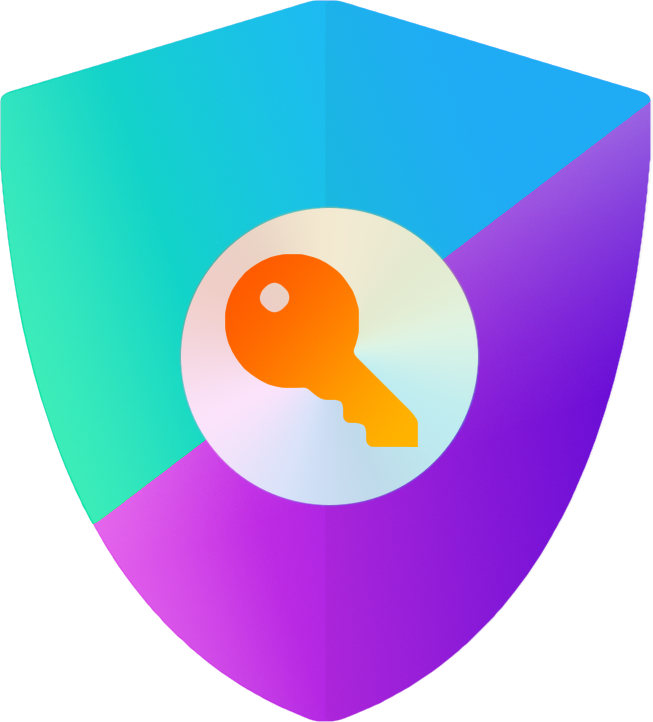
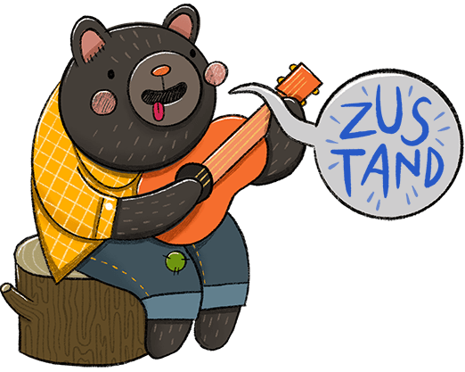

<p align="center">

</p>

<h1 align="center">
   I'm OatsProgramming
</h1>
<p align='center'>
    
</p>

```yaml
name: Jack Oats
located_in: Dallas, TX
profession: Full Stack Developer
education:
    [
        "Self-Taught Developer and Designer",
        "Associates in Nursing"
    ]
company: Yours ;)     (hire me?)
fields_of_interest:
    [
        "Web Dev",
        "UI/UX",
        "3D Designs",
    ]
currently_learning: ["React Three Fiber"]
want_to_learn: 
    [
        "React Native",
        "Figma",
        "Graphic Design in general",
        "Making JS faster"
    ]
hobbies: 
    [
        "Learning new ways to optimize JS/TS",
        "Indulging in Japanese animation",
    ]
```

<h2>
    My Tool Set
</h2>

### Libraries





 

### Languages


</p>

### Frameworks


</p>

<br/>
<br/>
<br/>
<br/>
<br/>

<p align="center">


</p>

## Support My Journey
[](https://venmo.com/u/OatsProgramming)

[](https://oatsprogramming-portfolio.vercel.app/)
